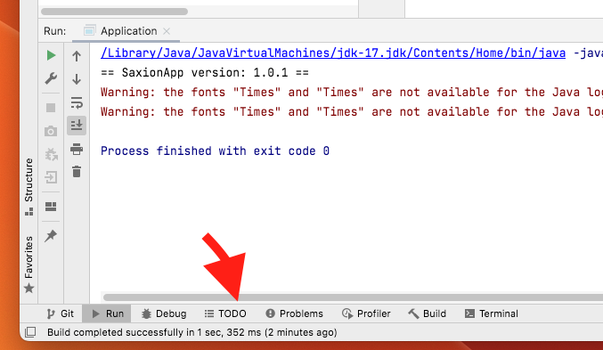

# FootballManager

## Exercise
This application contains many code smells, try to find them.
Add a comment for each comment you have found. Tip: use //TODO: <your description>. On the bottom in intelij you can quickly
navigate these TODO's. Bonus points if you have ideas how to improve this code
```java
//TODO: this is a code smell i have found!
```



## explanation
This football manager is used to stores football clubs. Each football club stores 11 players. You can use the app to
see data of all the clubs and players. There is also an option to simulate a match between 2 clubs!

- There are 3 clubs, use id:1-3
- Each team has 11 players
- Each player has 4 stats: offensive skill (left and right), defensive skill (left and right), keeper skill (not used)
- **play a match:** When a match between 2 clubs is simulated the following happens:
  - Club 1 attacks 5-10 times
    - a random attacker player is selected
    - a random defender player is selected
    - randomly the attack happens on the left side of the field or the right side
      - if left is selected the offensiveSkill-left of the attacker is compared with the defensiveSkill-left of the defender, 
      if the attacker has a higher value the attacking team scores!
      - if right is selected the same happens but for the right skills
  - Club 2 now attacks 5-10 times (using the same steps as above)
  - The team with the most points wins the match!

